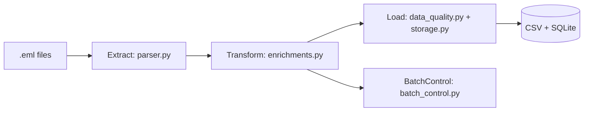

# Email Parser ETL Pipeline


[](https://github.com/d-daemon/eml-parser-pipeline/actions)


[](https://github.com/d-daemon/eml-parser-pipeline/blob/main/demo_notebook.ipynb)

A **lightweight ETL pipeline** for parsing `.eml` email files into structured data.
It's designed for demo purposes to showcase how to handle MIME-encoded emails, extract metadata, enrich and validate data, and persist results in both CSV and SQLite formats.

---

## Features

- **Extract** `.eml` files (multipart MIME) → messages and attachments
- **Transform** data with enrichment, normalization, and data-quality checks
- **Merge** attachments to parent messages using `message_id` as key
- **Load** outputs to both CSV and SQLite for portability
- **Batch Control** tracking for ETL run metadata
- **Interactive Jupyter Notebook** for step-by-step demo and validation

---

## Project Structure

```
eml-parser-pipeline/
├── config/              # Global configuration (paths, constants, schemas)
├── data/                # Working directory
│   ├── input/           # Input .eml files
│   ├── output/          # Output csv files and SQLite database
├── etl/                 # ETL modules/
│   ├── core/            # Logging and shared utilities
│   ├── extract/         # Email parser (MIME message + attachments)
│   ├── transform/       # Processing, enrichment, merge logic, and DQ checks
│   ├── load/            # Storage, batch control, and SQLite handling
│   └── main.py          # Orchestrator
├── examples/            # Sample email generator
├── tests/               # Unit tests
├── demo_notebook.ipynb  # Demo notebook
├── main.py              # Orchestrates full ETL pipeline
├── requirements.in      # Base dependencies (UV-managed)
├── requirements.txt     # Pinned dependencies
└── README.md
```

---

## Installation

```bash
git clone https://github.com/<your-username>/etl-email-parser.git
cd etl-email-parser
```

### Install dependencies

```bash
uv pip install -r requirements.txt
```

---

## Usage

1. Generate sample .eml files:

    ```python
    uv run examples/generate_sample_eml.py --output examples/sample_emails --count 5
    ```

2. Run the ETL pipeline:

    ```python
    uv run main.py --input examples/sample_emails --output data/output --workers 2
    ```

3. Inspect outputs:

   - Messages: `data/output/messages.csv`
   - Attachments: `data/output/attachments.csv`
   - Batch control: `data/output/batch_control.csv`
   - SQLite database: `data/output/etl_demo.db`

---

## Explore Interactively with Jupyter Notebook

Open the demo notebook:

```bash
jupyter notebook demo_notebook.ipynb
```

## Architecture



---

## Extending

- Swap SQLite with BigQuery or PostgreSQL
- Swap local CSV with GCS or S3

---

## License

MIT License

---
